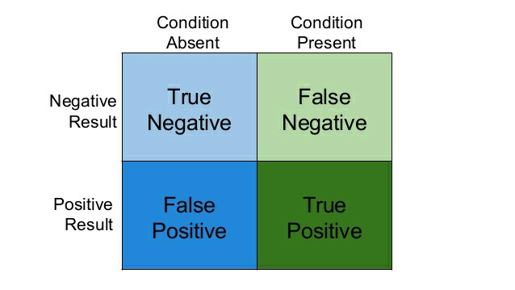
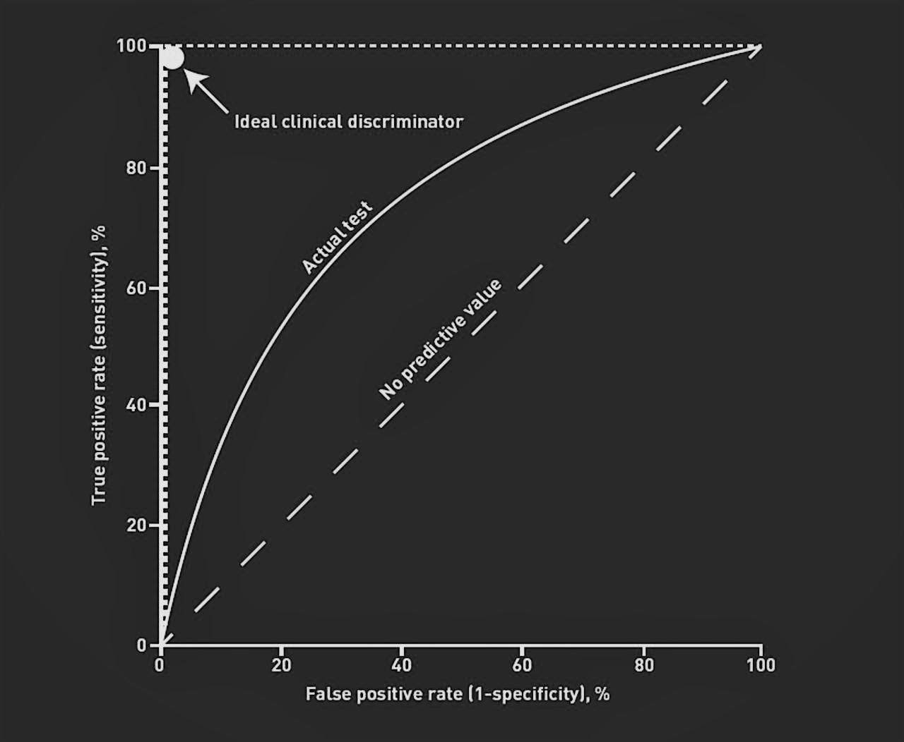

# Tutorials
This a quick overview (One-Liner) of AI tools / methods. For details please visit the linked notebook.

## Kaggle
https://www.kaggle.com/python10pm/sklearn-35-best-tips-and-tricks

## Data Peparation

### Image Data

#### Unify image data
Idea: To train / use nets on image data, images need to be made uniform (size, scaling, coloring, brightness  etc) to fit input layer of net.  
Notebook: DL_12_Model_Zoo
```bash
from keras.preprocessing.image import ...
from keras.applications.vgg16 import preprocess_input
```

#### Increase training data by adding noise (images)
Idea: Make detector more robust by changing input data (shift, zoom, glare, noise, coloring, etc.)
Notebook: DL_11_image_processing / DL_10_cnn_car_detection
```bash
from keras.preprocessing.image import ImageDataGenerator
import albumentations as A
```


### Scale Data
Idea: Scale data e.g. for models which compute distance between features  
Notebook:  
```bash
from sklearn.preprocessing import StandardScaler
```

### Randomize Data
Idea: x  
Notebook:  
```bash
from sklearn. import 
```

### Convert Data
Idea: x  
Notebook:  
```bash
from sklearn.feature_extraction.text import CountVectorizer
```

### Split Data
Idea: Train, test and validation dataset.  
Notebook: 36_hyperparameter_optimization  
```bash
from sklearn.model_selection import train_test_split
(from sklearn.model_selection import GridSearchCV)
```

### Polynomial features
Idea: x  
Notebook:  
```bash
from sklearn.preprocessing import PolynomialFeatures
```

### One-Hot Encoding
Idea: Create new columns for each unique field that is 1 when true.  
Notebook: 40_project_estimate_car_value  
```bash
from pandas import get_dummies
```

---
## Basisc

### Actication Funtions
Idea: Approximate complex functions with set of simple functions (e.g. compare Taylor-Series).  
Notebook: 50_cnn 
```bash
import keras
```


### Optimizers
Idea: Use numerical optimizers to optimize nets (e.g. rmsprop, adam, )  
Notebook: DL_10_cnn_car_detection
```bash
from keras.optimizers import RMSprop ...
```

---
## Classification

### KMeans
Idea: Label unlabeled data by finding clusters.  
Notebook: 41_kmeans  
```bash
from sklearn.cluster import KMeans
```


#### KMeans: Elbow Method
Idea: Find k for kMeans, where mean distance of cluster points to center stops to decrease significantly.
Notebook: 41_kmeans  
```bash
from sklean
```

### One-Vs-All
Idea: x  
Notebook:  
```bash
from sklearn. import 
```

### One-Vs-One
Idea: x  
Notebook:  
```bash
from sklearn. import  
```

### KNeighbors
Idea: x  
Notebook:  
```bash
from sklearn.neighbors import KNeighborsClassifier
```

### Decision Tree
Idea: x  
Notebook: See 26_decision_trees  
```bash
from sklearn. import 
```


### Random Forest
Idea: Train multiple decision trees.  
Notebook: See 28_random_forest  
```bash
from sklearn. import 
```


### Naive Bayes
Idea: Use probabilities (e.g. mutlivariate normal distribution)
Notebook: See 30_naive_bayes  
```bash
from sklearn.naive_bayes import MultinomialNB
```


### Support Vector Machine
Idea: Increase margin of classification border (depends on kernel) towards classifications  
Notebook: 32_svm_support_vector_machine  
```bash
from sklearn.svm import SVC
```


### Support Vector Machine with kernels
Idea: Map data into other/higher dimension (e.g. spherical coordinates) and apply linear SVM  
Notebook: 33_svm_with_kernel  
```bash
from sklearn.svm import SVC
```


### Neural Networs
Idea: Combine multitude of simple functions (neurons) to approximate complex relationships  
Notebook: 48_neuronal_networks    
```bash
from keras.models import Sequential
from keras.layers import Dense
```

#### Multi-Output Networks
Idea: One-Hot Encoding of data
Notebook: 48_neuronal_networks    
```bash
from keras.utils import to_categorical
```

---
## Metrics / Model Performance Parameters

### R2 Value
Idea: x  
Notebook:  
```bash
from sklearn.metrics import r2_score
```

### Learning curve
Idea: Does more data help my model?  
Notebook: 29_overfitting_underfitting  
```bash
from sklearn. import 
```


### Validation curve
Idea: Change parameters of model and visualize test/train performance  
Notebook: See 29_overfitting_underfitting  
```bash
from sklearn. import 
```


### Confusion matrix
Idea: Visualize true/false positive/negative in matrix to prevent neglection of underrepresented features.  
Notebook: 35_confusion_matrix  
```bash
from sklearn.metrics import confusion_matrix
```


### ROC curve
https://www.displayr.com/what-is-a-roc-curve-how-to-interpret-it/   
Idea: Curve that visualizes model performance while varying FPR and TPR.  
Notebook: 35_confusion_matrix  
```bash
from sklearn.metrics import roc_cuvre, roc_auc_score
```


### AUC of ROC curve
The AUC (area under curve) of the ROC-curve can be used as a matric for the model performance.

---
## Model Optimization / Selection

### k-fold cross-validation
Idea: 
Notebook:  
```bash
from sklearn. import 
```

### Parameter optimization

### Hyperparameter optimization
Idea: Parameter that influence the model structure (e.g. C and gamma of SVM).  
Notebook: 36_hyperparameter_optimization  
```bash
from sklearn.model_selection import GridSearchCV, ParameterGrid, ParameterSampler, RandomizedSearchCV
(from sklearn.pipeline import Pipeline)
```

### Decomposition / Reduce Dimensions

#### Covariance and Correlation
Idea: See if data columns are correlated / have a linear relation.  
Notebook: 38_correlation_covariance  
```bash
import pandas as pd
```

#### PCA - Principial component analysis
Idea: Reduce dimensions by finding net dimensions with maximal variance.  
Notebook: 36_pca_principal_componen_analysis  
```bash
from sklearn.decomposition import PCA
```

--- 
## Model visualization
### Trees

Idea: 
Notebook:  
```bash
import graphviz
```

---

## CNNs - Convolutional Neural Networks
Train convolution (popular operator on images) matrices on labeled images.  

### CNN-Layer : Convolution
Idea: Add convolution layer (popular operator on images)
Notebook: 50_cnn  
```bash
from keras.layers import Conv2D
```

### CNN-Layer : Dropout
Idea: Do not optimize some weights in optimization step. Helps to remove predominance of some weights.
Notebook: 50_cnn  
```bash
from keras.layers import Dropout
```

### CNN-Layer : Flatten
Idea: 
Notebook: 50_cnn  
```bash
from keras.layers import Flatten
```

### CNN-Layer : Max-Pooling
Idea: Make net robust against small translation by taking max value of mask (convolution).
Notebook: 50_cnn  
```bash
from keras.layers import MaxPooling2D
```

###  Visualize CNN
Project: https://www.cs.ryerson.ca/~aharley/vis/

---
## Misc

### Transfer Learning
Idea: Use pre-trained models (computationally demanding) to initialize weights and change last layer.
Notebook: 
```bash
from 
```


